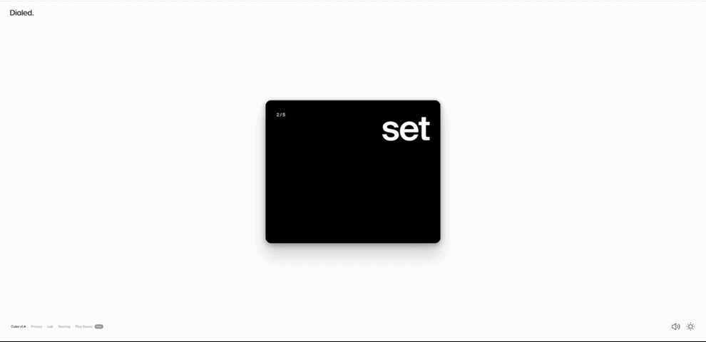
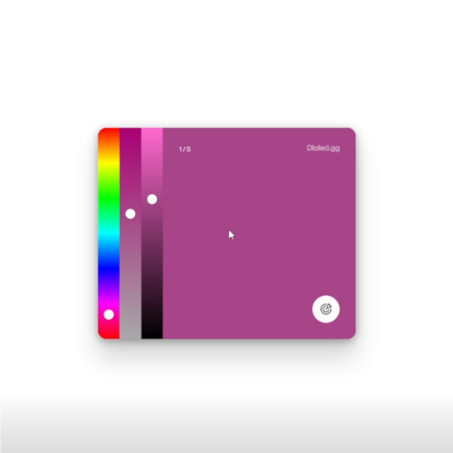
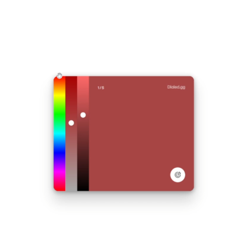
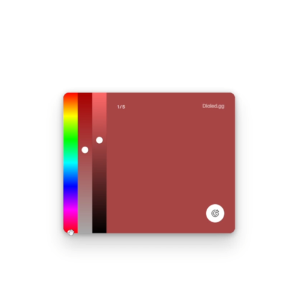
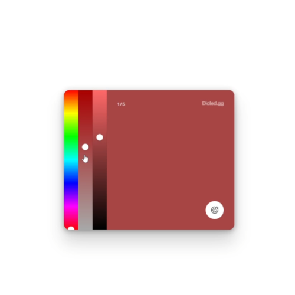
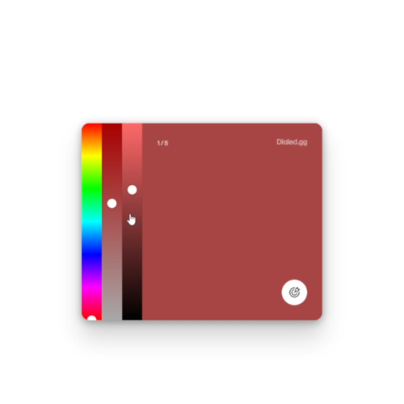

# Dialed.gg Bot

> A Python bot that can consistently achieve near-perfect scores on dialed.gg by capturing the target color from the screen and recreating it using automated slider controls.

---
**Demo:**

---

## 📥 Download
Get the latest release [here](https://github.com/hero0ic/Dialed.gg-Bot/releases/latest).

---
## ⚙️ How it works

1. **Calibration**
   - User selects screen positions (color preview + sliders)

2. **Capture**
   - App reads pixel color during preview phase

3. **Convert**
   - RGB → HSV using `colorsys`

4. **Detect transition**
   - Monitors pixel change to detect when preview phase ends

5. **Apply**
   - Maps HSV values to slider positions and adjusts them automatically

---

## 🖥️ Calibration Guide
To set up the bot, complete the calibration process by hovering over each required position and pressing **Enter**. For optimal accuracy, closely follow the positions shown in the calibration guide below.

**Step 1.** Hover over the CENTER of the color swatch

**Step 2.** Hover over the TOP of the hue slider

**Step 3.** Hover over the BOTTOM of the hue slider

**Step 4.** Hover ANYWHERE over the saturation slider

**Step 5.** Hover ANYWHERE over the brightness slider

---

## 🚀 Usage
*See the demo for help if needed*
1. Launch `dialed-bot.exe`
2. Complete the calibration
3. Start a game and wait for the preview phase
4. When the preview phase begins, run the bot with the game window open
5. Repeat steps 3 and 4 each round

**Note:** If accuracy seems off, click **Recalibrate** and redo the calibration steps.
